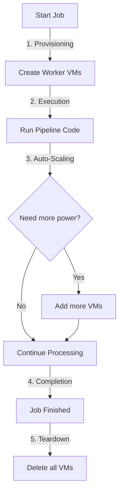

# How Dataflow Works Under the Hood

You are absolutely correct! Here is the step-by-step lifecycle of what happens in the backend when you run a Dataflow job.

## The Lifecycle of a Dataflow Job

### 1. Provisioning (Startup)
When you submit a job, Dataflow:
*   Analyzes your code (the graph).
*   Calculates how many resources are needed.
*   **Spins up Compute Engine VMs (Nodes)** automatically. You don't manage these; Google does.

### 2. Execution (Running)
*   The VMs download your Docker image (the Flex Template).
*   They start processing your data in parallel.
*   **Auto-scaling:** If the data is huge, Dataflow adds *more* nodes automatically. If data shrinks, it removes them.

### 3. Teardown (Cleanup)
*   **Batch Jobs (Like yours):** Once the job finishes processing all files, Dataflow **automatically deletes** all the worker VMs. You stop paying for compute immediately.
*   **Streaming Jobs:** These run forever (24/7) until you manually cancel them. They keep the VMs running constantly.

## Summary
*   **Is it creating nodes?** Yes, temporary VMs are created just for your job.
*   **Is it running the job?** Yes, the logic runs on those VMs.
*   **Does it delete them?** Yes! For Batch jobs, resources are destroyed automatically upon success or failure.

**You only pay for the exact seconds the VMs were alive.**
