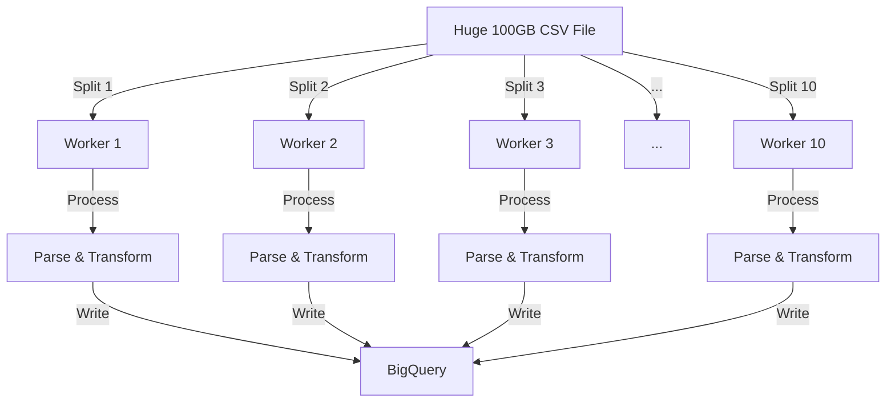

# How Dataflow Distributes Processing

Yes, Dataflow is **fully distributed processing**. It is based on the **Apache Beam** model, which is designed specifically to split huge datasets across many computers (workers).

## Visualizing Distributed Processing

Imagine you have a **100 GB CSV file** and **10 workers**.



## Key Concepts

### 1. PCollections (Parallel Collections)
In your code, `p` (the pipeline object) creates **PCollections**.
*   A PCollection is **not** a normal list in memory.
*   It is a **logical definition** of data that can be split into millions of chunks.
*   Dataflow doesn't load the whole file into one machine's RAM.

### 2. Bundling & Splitting
*   **Splitting:** Dataflow looks at your input (e.g., `gs://bucket/*.csv`). If you have 100 files, it might assign 10 files to each worker. If you have one huge file, it splits that file into byte ranges (e.g., bytes 0-10MB to Worker 1, 10MB-20MB to Worker 2).
*   **Bundling:** Dataflow groups items into "bundles" (small batches) to process efficiently.

### 3. Independent Workers
*   Each worker runs your `ParseCSV` code independently.
*   Worker 1 doesn't know what Worker 2 is doing.
*   This is why it's "Shared Nothing" architecture – very fast and scalable.

### 4. Dynamic Work Rebalancing (The "Magic")
If Worker 1 gets a "hard" chunk of data and is slow, and Worker 2 finishes early:
*   Dataflow **detects** this straggler.
*   It **steals work** from Worker 1 and gives it to Worker 2.
*   This ensures the job finishes as fast as possible.

## Your Pipeline Example

```python
(p
 | 'Read' >> ReadFromText(...)  # <--- Distributed Read (Splits files)
 | 'Parse' >> ParDo(ParseCSV()) # <--- Distributed Processing (Runs on all workers)
 | 'Write' >> WriteToBigQuery(...) # <--- Distributed Write (Parallel inserts)
)
```

*   **ReadFromText**: Automatically splits files into chunks.
*   **ParDo (Parallel Do)**: The name says it all. It runs your function in parallel across all available workers.
