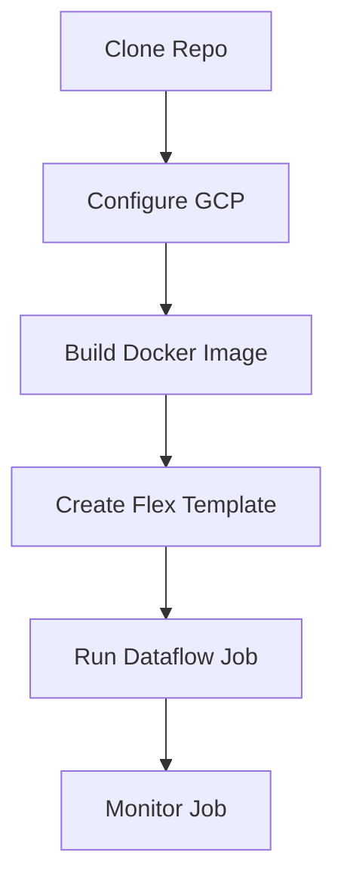

# Simple Execution Guide

Follow these steps to deploy and run the Dataflow pipeline.

## Execution Flow



## Step-by-Step Instructions

### 1. Clone Repository
```bash
git clone <your-repo-url>
cd dataflow
```

### 2. Configure GCP
Open `setup_gcp.sh` and modify **only lines 16-22** with your details:

```bash
PROJECT_ID="your-project-id"
REGION="us-central1"
SERVICE_ACCOUNT="your-sa@project.iam.gserviceaccount.com"
SA_KEY_PATH="C:/path/to/key.json"
BUCKET_NAME="your-unique-bucket"
DATASET_NAME="dataflow_dataset"
TABLE_NAME="output_table"
```

Then run the setup:
```bash
chmod +x setup_gcp.sh
./setup_gcp.sh
```

### 3. Modify Logic (Optional)
If needed, edit `pipeline.py` to change how data is processed.

### 4. Build Docker Image (GCP)
```bash
export PROJECT_ID="your-project-id"
export TEMPLATE_NAME="gcs-to-bq-template"
export IMAGE_NAME="gcr.io/$PROJECT_ID/$TEMPLATE_NAME"

gcloud builds submit --tag $IMAGE_NAME .
```

### 5. Create Flex Template
```bash
export BUCKET_NAME="your-unique-bucket"
export TEMPLATE_PATH="gs://$BUCKET_NAME/templates/$TEMPLATE_NAME.json"

gcloud dataflow flex-template build $TEMPLATE_PATH \
  --image $IMAGE_NAME \
  --sdk-language PYTHON \
  --metadata-file metadata.json
```

### 6. Run Dataflow Job (Small Job Config)
Run with limited workers to save costs:

```bash
export JOB_NAME="small-job-$(date +%Y%m%d-%H%M%S)"
export INPUT_PATH="gs://$BUCKET_NAME/input/*.csv"
export OUTPUT_TABLE="$PROJECT_ID:$DATASET_NAME.$TABLE_NAME"
export SERVICE_ACCOUNT="your-sa@project.iam.gserviceaccount.com"

gcloud dataflow flex-template run $JOB_NAME \
  --template-file-gcs-location=$TEMPLATE_PATH \
  --region="us-central1" \
  --worker-machine-type="e2-small" \
  --max-workers=1 \
  --num-workers=1 \
  --parameters input_path=$INPUT_PATH \
  --parameters output_table=$OUTPUT_TABLE \
  --service-account-email=$SERVICE_ACCOUNT \
  --staging-location="gs://$BUCKET_NAME/temp" \
  --temp-location="gs://$BUCKET_NAME/temp"
```

### 7. Monitor Dataflow
*   Check job status: `gcloud dataflow jobs list`
*   View logs in [Google Cloud Console](https://console.cloud.google.com/dataflow/jobs)
